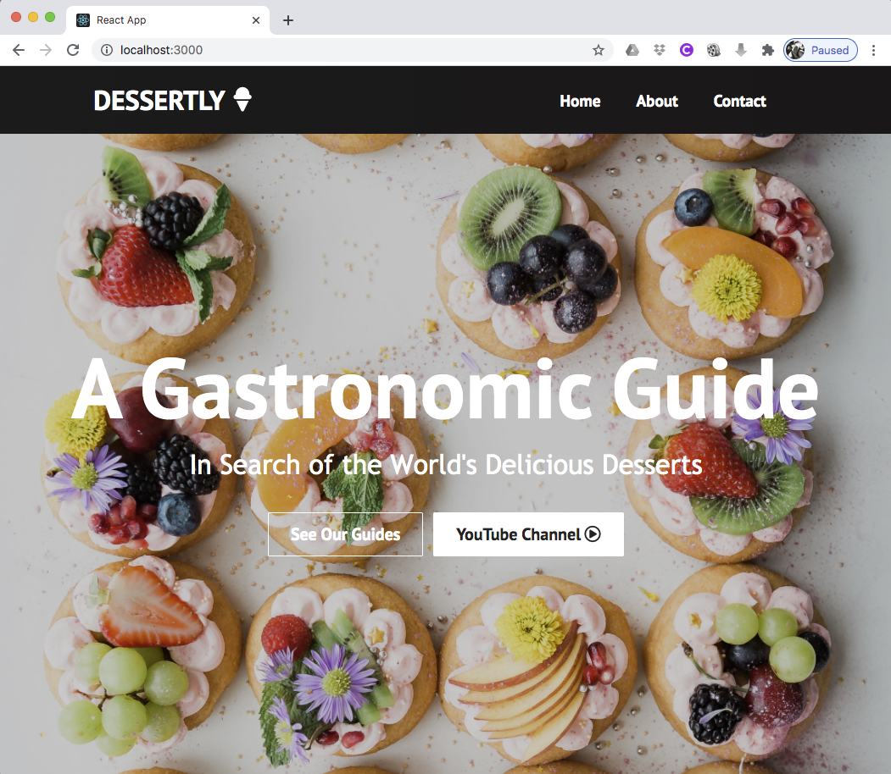
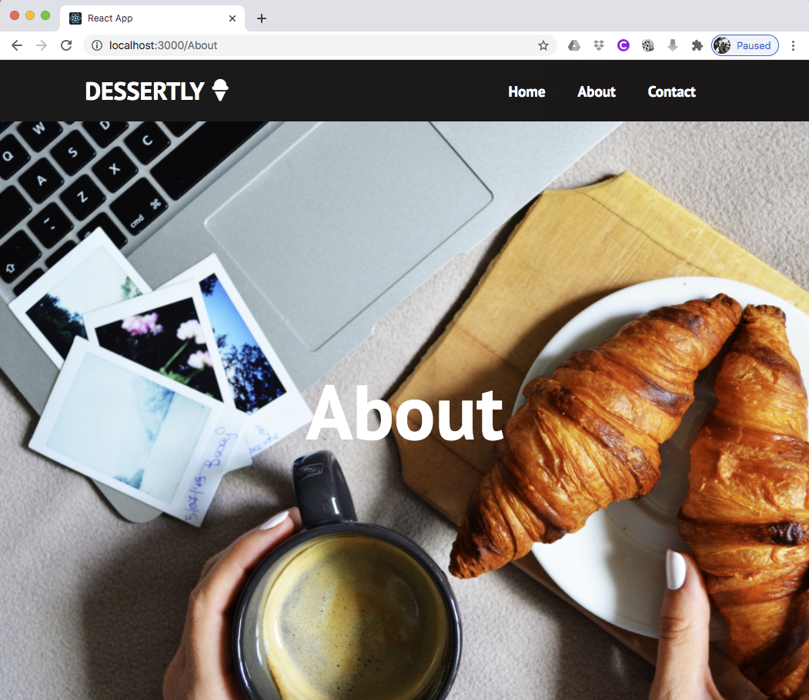
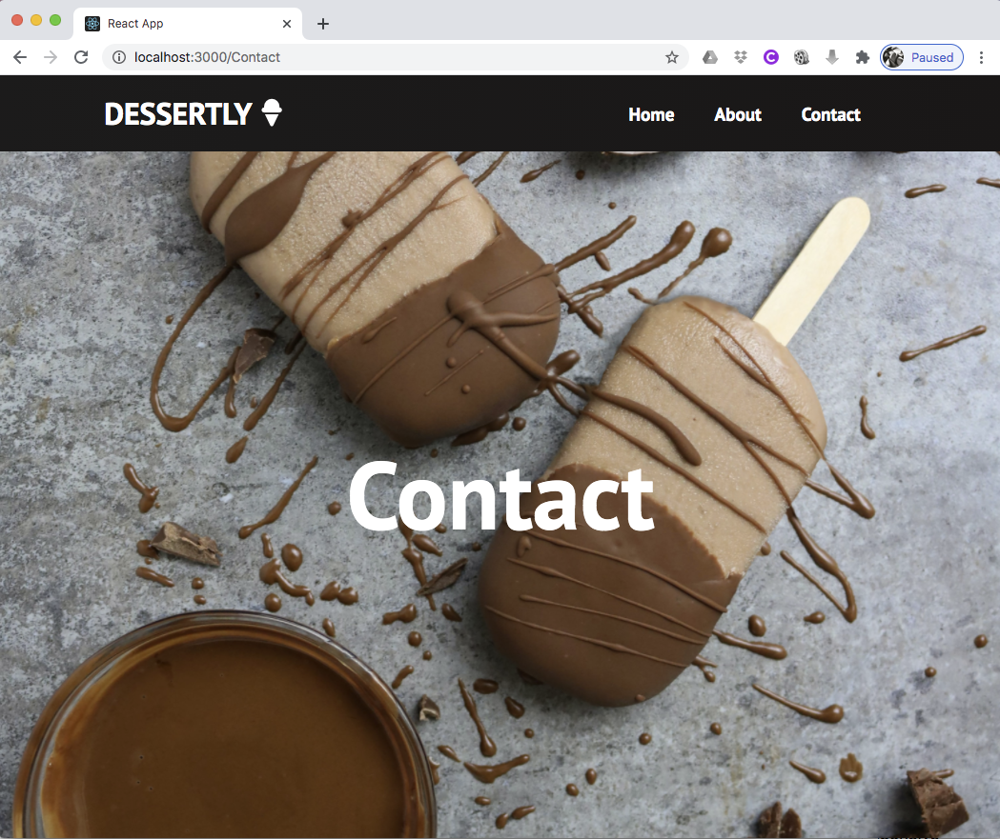

# A Simple Website using Create React App
### by Gavin Pili

This project was bootstrapped with [Create React App](https://github.com/facebook/create-react-app).  This gh-pages was created to render the webpage through a browser.

**You can view the project here: https://gavinpwd.github.io/react-project-website/

## Backstory

I've started my learning module on React through Codecademy and have completed some exercises.  I wanted to test my knowledge so I searched for YouTube videos for a follow-along coding project.  After I've set up terminal, installed node.js and some extensions on VSCode, this video helped me with this project: React Website Tutorial - Beginner React JS Project Fully Responsive || Link: https://www.youtube.com/watch?v=I2UBjN5ER4s  It was a two-hour tutorial however I skipped the topics that I haven't learned from Codecademy but spent more than two hours anyway.  This tutorial was super helpful and I have learned a few tricks on VSCode too.

**The idea behind the website was inspired by my travels as guided by gastronomy -- to find and experience the world's delicious desserts.**

## What I have learned:
1. This tutorial tested my CSS knowledge.
2. I've learned that I actually liked coding in React as it is organised and the syntax seems easy to understand compared to pure JavaScript.
3. I have learned how to create three basic pages, and this would be a great starting point to add more content and to manipulate the layout.

## What's next for me:
1. I want to add components like Photo Gallery, Photo Grids, forms and maybe some cool animations.
2. I would break my Codecademy learning in short blocks with Youtube tuorials like this to reinforce the lessons.
3. Practice practice practice.

**Screenshots**

Home Page -- image credit: https://unsplash.com/photos/V4MBq8kue3U

About Page -- image credit: https://unsplash.com/photos/Mma3aVAH0F0

Contact Page -- image credit: https://unsplash.com/photos/C6eovoS7gXo

Home Page Mobile Responsive View-- image credit: https://unsplash.com/photos/V4MBq8kue3U

